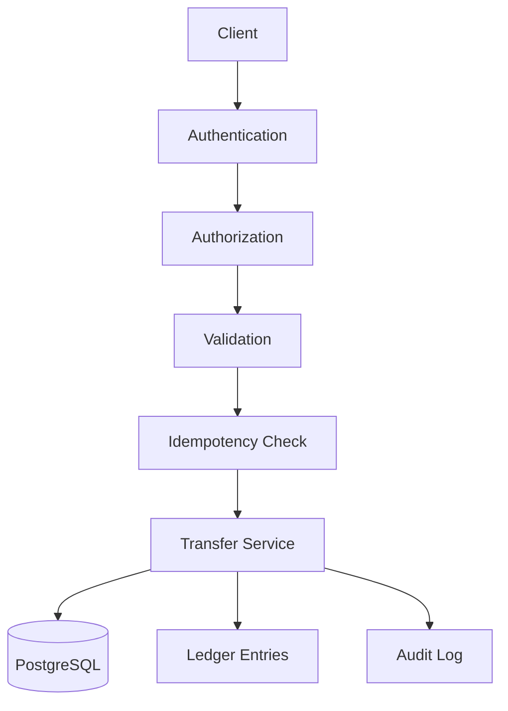

# Architecture

The system is a modular monolith with a single consistency boundary: PostgreSQL.

## Runtime flow

1. The client sends `POST /transactions` with a bearer token and idempotency key.
2. Authentication loads the user from PostgreSQL.
3. Authorization checks that the source account belongs to that user.
4. The transfer service canonicalizes the request and hashes it.
5. The service reserves the idempotency key inside the same transaction boundary.
6. Both account rows are locked in deterministic order.
7. The transfer updates balances, writes the transaction row, writes two ledger entries, and records an audit log.
8. The transaction commits atomically or rolls back completely.

## Main risk

The main risk is divergence between application state and financial reality during retries, timeouts, or concurrent transfers. The mitigation is to keep all mutating transfer logic inside one database transaction, use `FOR UPDATE` locks, and rely on database constraints and idempotency keys instead of application memory.
